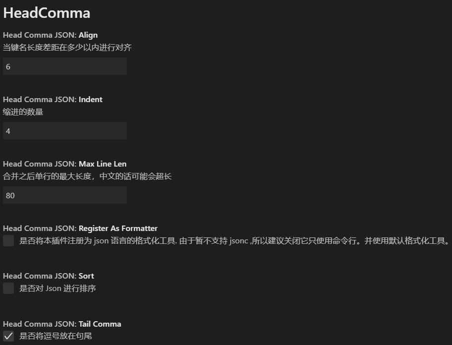
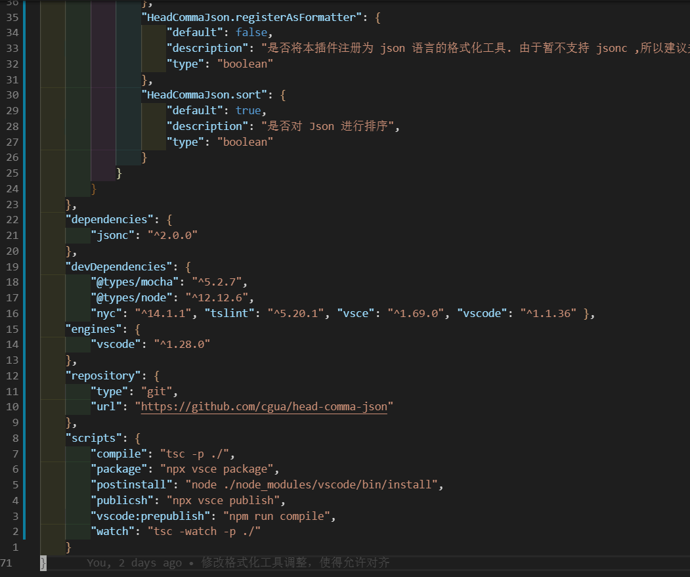
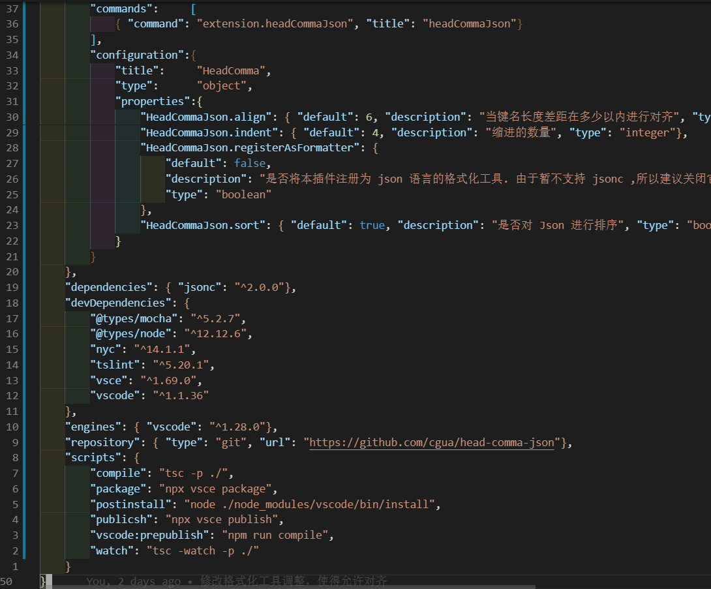
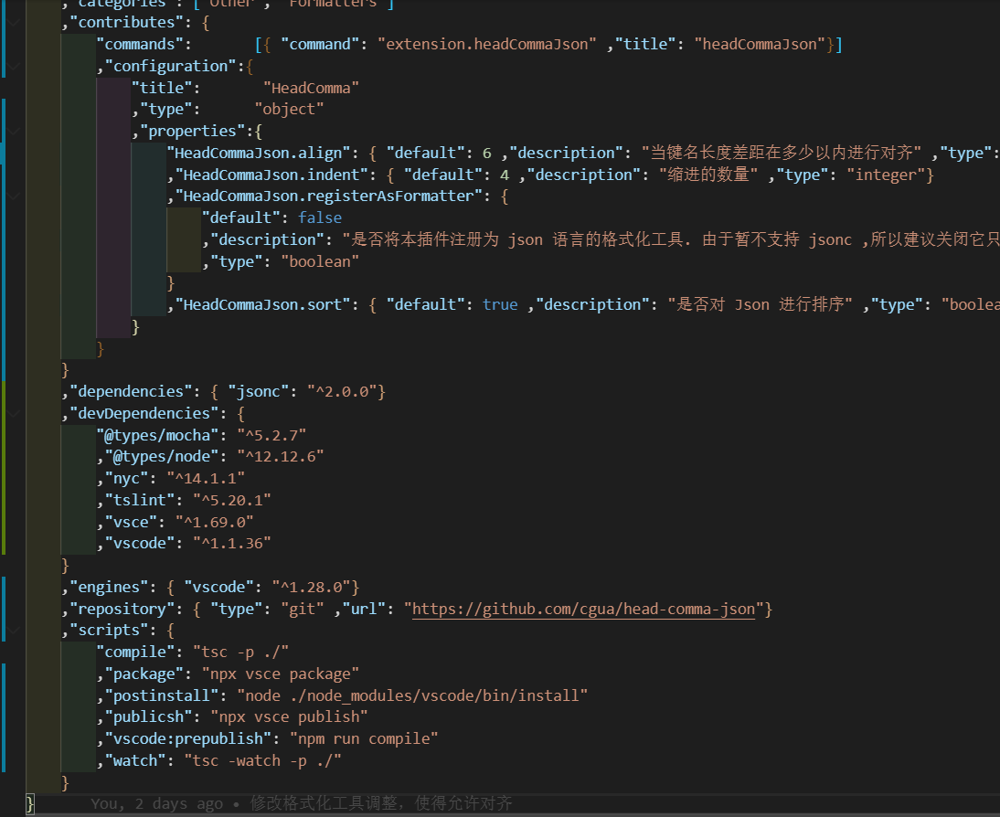

# head-comma-json README

## 作用

* 排序 json 
* 根据设定对齐键值
* 使用以 “,” 开头的形式格式化 json 文件 (一般习惯都是将逗号放在句尾)

**＊副作用：会去掉 jsonc 文件的注释 (&gt; &lt;)**

## Known Issues

1. jsonc 注释会丢失

## 效果展示

### ============= 设置 =============

&nbsp;

&nbsp;

### ============= 原始 json ============= 

&nbsp;

&nbsp;

### ============= 句尾逗号 ============= 

&nbsp;

&nbsp;

### ============= 句首逗号 ============= 

